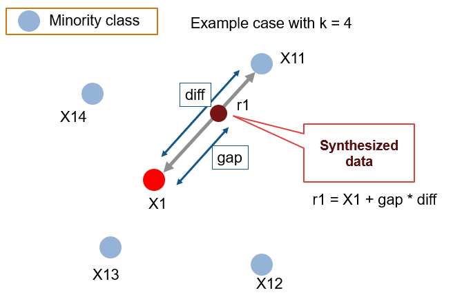

```{r, include=FALSE, message=FALSE,echo=FALSE}

# Load libraries
library(ggplot2)        # Basic plots
library(gridExtra)      # Multiple plot same figure
library(dplyr)          # Play w/ dataframes
library(broom)          # tidy()
library(GoodmanKruskal) # nice Corr Matrix
library(Hmisc)          # compute rcorr between quantitative vars
library(corrplot)       # plot nice corr matrix
library(caret)          # trainControl (train tree predictor)
library(pROC)
library(car)
library(randomForest)
#library(performanceEstimation)

###################################################################
# SMOTE stuff
library(ROCR)

remotes::install_github("dongyuanwu/RSBID")
library(RSBID) #cmd above to install it
###################################################################

# Set the current directory as working directory and load custom functions.
setwd(dirname(rstudioapi::getSourceEditorContext()$path))
source("../utils/plots.R")
source("../utils/data_analysis.R")

```


\begin{abstract}
In the following paper we will present a statistical analysis of stroke related data. Our goal will be to predict whether a patient is likely to get a stroke based on multiple input parameters like gender, age, various diseases, and smoking status.
Each row in the data provides relevant information about the patient.

After some data cleaning, we plotted some interesting variables of our dataset to get some insight on
the content and structure of our data.
We then proceeded to the analysis. 


\end{abstract}

\section{Data}

We will now load and present our dataset (that can be retrieved at the following [link](https://www.kaggle.com/fedesoriano/stroke-prediction-dataset)). \

\begin{enumerate}
\item id: unique identifier
\item gender: [Male, Female, Other]
\item age: age of the patient
\item hypertension = $\begin{cases} 1 \quad \text{if the patient has hypertension}\\  0 \quad \text{otherwise} \end{cases}$
\item heart\_disease = $\begin{cases} 1 \quad \text{if the patient has a heart disease}\\  0 \quad \text{otherwise} \end{cases}$
\item ever\_married = [Yes, No]
\item work\_type = [children, Govt\_jov, Never\_worked, Private, Self-employed]
\item Residence\_type = [Rural, Urban]
\item avg\_glucose\_level: average glucose level in blood
\item bmi: body mass index
\item smoking\_status = [formerly smoked, never smoked, smokes, Unknown\footnote{The information is unavailable for this patient}]
\item stroke = $\begin{cases} 1 \quad \text{if the patient had a stroke}\\  0 \quad \text{otherwise} \end{cases}$
\end{enumerate}
\newpage
```{r echo=FALSE}
# Load and summarize dataset
dataset = read.csv("stroke.csv")
str(dataset)
```


\section{Data Cleaning}

We convert our variables to the right data type and we show the updated summary.\

```{r, warning=FALSE,echo=FALSE}
# Remove id column (useless)
dataset$id = NULL

# Convert qualitative variables in factors
dataset$gender          = factor(dataset$gender)
dataset$hypertension    = factor(dataset$hypertension, levels = c(0,1), labels = c("No", "Yes"))
dataset$heart_disease   = factor(dataset$heart_disease, levels = c(0,1), labels = c("No", "Yes"))
dataset$ever_married    = factor(dataset$ever_married)
dataset$work_type       = factor(dataset$work_type)
dataset$residence_type  = factor(dataset$Residence_type)
dataset$smoking_status  = factor(dataset$smoking_status)
dataset$stroke          = factor(dataset$stroke, levels = c(0,1), labels = c("No", "Yes"))

# Convert quantitative variable in numeric
dataset$bmi             = as.numeric(dataset$bmi)

# Remove duplicate column (due to uppercase)
dataset$Residence_type  = NULL 

# Show dataset summary
str(dataset)

```
\section{ Data Visualization}

We can use different boxplots to visualize possible relations between our quantitative variables (**age**, **bmi** and **average glucose level**) and stroke status.\

```{r, warning=FALSE, fig.width=10, echo=FALSE}
grid.arrange(ggplot(dataset, aes(x=stroke ,y=age)) +
              geom_boxplot(fill= "#FDE725FF", alpha= 0.7), 
            ggplot(dataset, aes(x=stroke, y=bmi))+
              geom_boxplot(fill= "#2D708EFF", alpha= 0.7), 
            ggplot(dataset, aes(x=stroke, y=avg_glucose_level))+
              geom_boxplot(fill= "#440154FF", alpha= 0.7), 
            ncol=3)
```

From the plots above we can infer the following:
\begin{itemize}
\item \textbf{Age}: older people are more likely to have a stroke.
\item \textbf{Bmi}: there is no evident relation between stroke and bmi.
\item \textbf{Average glucose level}: the higher the level of glucose, the higher the relation with stroke
\end{itemize}

\newpage

Below we plot a few matrices to visualize possible relations between our qualitative variables and stroke status.\

```{r, warning=FALSE, fig.width=10, fig.height=7, fig.align='center', echo=FALSE}
grid.arrange(factors_plot(tidy(table(dataset %>% dplyr::select(stroke,work_type))), palette='Blues',
                         font_count_size=4, font_normalized_size=5.1, font_percentages_size=2.5,
                         font_categories_size=10), 
            factors_plot(tidy(table(dataset %>% dplyr::select(stroke,smoking_status))), palette='Greens',
                         font_count_size=4, font_normalized_size=5.1, font_percentages_size=2.5,
                         font_categories_size=10),
            factors_plot(tidy(table(dataset %>% dplyr::select(stroke,gender))), palette='Purples',
                         font_count_size=4, font_normalized_size=5.1, font_percentages_size=2.5,
                         font_categories_size=10),
            ncol=3, nrow=1)
```
```{r, warning=FALSE, fig.width=10, fig.height=5, fig.align='center', echo=FALSE}
grid.arrange(factors_plot(tidy(table(dataset %>% dplyr::select(stroke,hypertension))), palette='Greens',
                         font_count_size=3.5, font_normalized_size=5, font_percentages_size=2.5,
                         font_categories_size=10), 
            factors_plot(tidy(table(dataset %>% dplyr::select(stroke,heart_disease))), palette='Blues',
                         font_count_size=3.5, font_normalized_size=5, font_percentages_size=2.5,
                         font_categories_size=10), 
            factors_plot(tidy(table(dataset %>% dplyr::select(stroke,residence_type))), palette='Purples',
                         font_count_size=3.5, font_normalized_size=5, font_percentages_size=2.5,
                         font_categories_size=10),
            factors_plot(tidy(table(dataset %>% dplyr::select(stroke,ever_married))), palette='Oranges',
                         font_count_size=3.5, font_normalized_size=5, font_percentages_size=2.5,
                         font_categories_size=10),
            ncol=2, nrow=2)

```
\newpage
From these comparison matrices we can deduce the following:
\begin{itemize}
\item A lot of our subjects work in the private sector (57.24\%) and do not smoke (37\%), we can also notice a high predominance of subjects without hypertension (90.25\%) and heart diseases (94.6\%). These data should not worry us because they do not indicate unbalance in our dataset but just reflects the actual distribution of global population\footnote{Further information on this subject can be found at the following links: \begin{itemize}
                        \item \href{https://www.economicshelp.org/blog/2634/economics/private-sector-vs-public-sector/}{Work type}
                        \item \href{https://ourworldindata.org/smoking}{Smoking status}
                        \item \href{https://www.medscape.com/answers/241381-7614/what-is-the-global-prevalence-of-hypertension-high-blood-pressure}{Hypertension}
                        \item \href{https://pubmed.ncbi.nlm.nih.gov/32742886/}{Heart diseases}
                       \end{itemize}}.
\item We miss a lot of information on the smoking status of our participants (30.2\% unknown), this could evolve in a modeling problem if we do not address it properly.
\item A lot of our subjects have not suffered a stroke (95.1\%), this could cause us some problems but we will address it using the SMOTE technique.
\end{itemize}

Now we can finally show **qualitative** and **quantitative** correlations.

```{r, warning=FALSE, fig.align='center', echo=FALSE}
qualitative_vars = c('gender', 'hypertension', 'heart_disease', 'ever_married',
                      'work_type', 'smoking_status', 'residence_type')
plot(GKtauDataframe(dataset %>% dplyr::select(all_of(qualitative_vars))))
```
```{r, fig.height=4, fig.width=5, fig.align='center', echo=FALSE}

quantitative_vars = c('age', 'avg_glucose_level', 'bmi')
corr <- rcorr(as.matrix(dataset %>% dplyr::select(all_of(quantitative_vars))))
corrplot(corr$r, type = "upper", tl.col = "black", tl.srt = 45)
``` 

From the results above we are lead to believe that there is no multicollinearity in our instrumental variables. We will provide more evidence for this later, when we perform the regression. 

The only two correlations that stand out are the one between work_type and ever_married and the one between age and bmi, as expected. These two correlations are understandable given the nature of the data. 
Let us inspect this even further with some plots.


\newpage

```{r, echo=FALSE, warning=FALSE, message=FALSE,echo=FALSE}
factors_plot(tidy(table(dataset %>% dplyr::select(ever_married,work_type))), palette='Blues',
                         font_count_size=4, font_normalized_size=5.1, font_percentages_size=2.5,
                         font_categories_size=10)
```


This plot shows why there is correlation between the variables work_type and ever_married: the levels Never_worked and children in the work_type variable both have 0% of observations who have ever been married. This is unserstandable since children can't be married and people who have never worked are young are really likely to have never been married.


```{r, include=FALSE, message=FALSE,echo=FALSE}
#finding the intercept to use in the next plot
fit <- lm(bmi~age, data=dataset)
fit
```

```{r, echo=FALSE, warning=FALSE, message=TRUE}
plot(x=dataset$age, y=dataset$bmi) +
lines(0:100, c(0:100)*0.2+23, col='red')
```

With this plot a slight correlation between the variables bmi and age is noticeable.
However, this correlation is not strong enough to influence our model later on.


\section{Data Manipulation}

In order to facilitate our work, we removed the level **other** from the variable gender and the level **never_worked** from the variable work_type, since they are not relevant for the analysis.\

```{r echo=FALSE}
# Remove rows
dataset = dataset %>%
          filter(gender != 'Other') %>%
          filter(work_type != 'Never_worked')

# Remove related levels
dataset = droplevels(dataset)
```

\subsection{NA Values}

We now look for NA values in our dataset:

```{r echo=FALSE}
# Check for NA in all columns
for (col_name in colnames(dataset)){
   if (anyNA(dataset[[col_name]]))
    print(paste(col_name, '-> ', sum(is.na(dataset[[col_name]])), ' NA'))
}
```

We notice that we have 201 NA just in the **bmi** variable.
In order to avoid losing these rows, given that we already have a small dataset, we will predict their values using a Decision Tree to approximate its value.\

```{r, warning=FALSE, message=FALSE,echo=FALSE}

# Define test set as set with missing data
missing_index <- which(is.na(dataset$bmi))

test_set <- dataset[missing_index,]
train_set <- dataset[-c(missing_index),]

# Fit the tree
tree = caret::train(bmi ~ ., 
                    data=train_set, 
                    method="rpart", 
                    trControl = trainControl(method = "cv"))

# Replace missing data with predicted data
bmi_pred <- predict(tree, newdata = test_set)
dataset[missing_index, 'bmi'] <- bmi_pred

# clean global environment
rm(test_set, train_set, tree, bmi_pred, missing_index)
```


\section{Statistical Model}

We will now begin splitting our dataset in train/test.\

```{r echo=FALSE}
# Set a fixed seed in order to have reproducible results
set.seed(42)

# 60-40 split
split_train_test <- createDataPartition(y = dataset$stroke, p=0.6, list = F)
train <- dataset[split_train_test,]
test <-  dataset[-split_train_test,]

print(table(train$stroke))
print(table(test$stroke))
```

\subsection{SMOTE algorithm}

Since our dataset has a problem of unbalance, we will use the \href{https://arxiv.org/pdf/1106.1813.pdf}{SMOTE} algorithm to create synthetic new data.\
```{r, warning=FALSE, message=FALSE,echo=FALSE}
# New smote algorithm
train_smoted <- SMOTE_NC(train, "stroke", k = 2, perc_maj = 50)

# Now we have a balanced dataset
print('This was the regular training set balance between the response classes:')
table(train$stroke)
```
This is the oversampled one. Notice that we could have oversampled since reaching the perfect balance. This is, altough, not advisable. We can obtain better performances helping the algorithms understand this still is a minority class and indeed, we do.
```{r}
table(train_smoted$stroke)
```
Notice that the SMOTE algorithm was only applied to the train set, this is done on purpose to avoid the evaluation of our final model on synthetic data.\
The minority class is over-sampled by taking each minority class sample and introducing synthetic examples along the line segments joining any/all of the k minority class nearest neighbors.

Take the difference between the feature vector (sample) under consideration and its nearest neighbor. Multiply this difference by a random number between 0 and 1, and add it to the feature vector under consideration. This causes the selection of a random point along the line segment between two specific features.

\subsection{Logistic Regression}

We perform a logistic regression using \textbf{stroke} as the dependent variable and the rest of the data as independent variables in order to see if we find some significant relationships.

```{r echo=FALSE}
Logit <- glm(stroke~., data=train_smoted, family = binomial(link = "logit"))
summary(Logit)
vif(Logit)
```

The significant variables are `age, heart disease, average glucose level and smoking status`, 
which have a positive impact on the increase of the logit probability.
Note `gender Male` and `Married`.

Now we can also state with certainty that there is no multicollinearity in our data, due to the results
of the variance inflation factor test. In fact, all the values of the VIF are very close to 1, which 
indicates an almost total absence of multicollineairty.


\subsection{Confusion Matrix and Statistics}

We will now evaluate our model over the test set.


```{r echo=FALSE}
library(caret)
lr_prob1 <- predict(Logit, newdata = test, type = "response")
lr_pred1 <- ifelse(lr_prob1 > 0.5,"Yes","No")

tb <- table(Predicted = lr_pred1, Actual = test$stroke)[2:1, 2:1]

confusionMatrix(tb)
print(paste0("F1: ", F_meas(tb)))
```
```{r, warning=FALSE, message=FALSE, echo=FALSE}
test_roc <- roc(as.numeric(test$stroke)~lr_prob1 , plot = TRUE, print.auc = TRUE,percent=TRUE, ci=TRUE)
```
```{r, warning=FALSE, message=FALSE,echo=FALSE}
print(test_roc$auc)
```
As we can see from the outputs above, our model does not perform very well. 
it correctly predicts just bit more than 50\% of the positive results (in our case, people who suffered a stroke), at the expense of a lot of false positives.
Because this is such a sensitive subject, we would definitely prefer having more false positives than false negatives.

The problem of this underperforming model could be addressed in two different ways:
\begin{enumerate}
\item We could speak with the stakeholders to understand how to best tune our threshold. In a real-world scenario this would translate into a discussion regarding the number of people we can take care of, even if they are false positives, in order to avoid rejecting people who actually need our help.

\item We could try and increase the accuracy of our model, and we will do that below using a Boosting technique.
\end{enumerate}

\section{Boosting}

Boosting is a technique used that convert weak learners to strong ones, and it works by sequentially learning weak classifiers with respect to a distribution and adding them to a final strong classifier.
Notice that, when they are added to the model, all the learners are weighted with relation to their prediction accuracy.

```{r echo=FALSE}
gbmGrid <- expand.grid(nIter=c(120,135,230,350,500))


trctrl <- trainControl(method = "repeatedcv"
                       , number = 10
                       , repeats = 5
                       #, search = "random"
                       , classProbs = T
                       , summaryFunction = twoClassSummary
                       )

logit_fit <- train(stroke ~., data = train_smoted, method = "LogitBoost", trControl=trctrl,
                   tuneGrid=gbmGrid, 
                   metric= "ROC"
                   )
logit_fit

```
```{r, echo=FALSE}
plot(logit_fit)
```
```{r, warning=FALSE, message=FALSE, echo=FALSE}
pred <- round(predict(logit_fit, newdata = test, type = "prob"),3)
prob <- unlist(pred[2])
```


```{r predicting boost, echo=FALSE}
preds <- as.factor(ifelse(pred[2] > 0.5,'Yes','No'))


tb <- table(Predicted = preds, Actual = test$stroke)[2:1, 2:1]


#print(paste0('Accuracy:', round((tb[1:1,1:1] + tb[2:2, 2:2])/(tb[1:1,2:2] + tb[2:2, 1:1] + tb[1:1,1:1] + tb[2:2, 2:2]),2)))

#print(paste0("Recall: ", round(recall(tb),2)))
#print(paste0("Precision: ", round(precision(tb),2))) 

confusionMatrix(tb)
print(paste0("F1: ", round(F_meas(tb),2)))
```
```{r echo=FALSE}
test_roc <- roc(as.numeric(test$stroke)~prob , plot = TRUE, print.auc = TRUE,percent=TRUE, ci=TRUE)
```
We can notice in the output above that boosted logistic our model improves its accuracy at a constant threshold of 0.5 (from 82\% to 90\%) when 5000 iterations are computed but with a worst ROC AUC (74\%).

It would probably be better to stand with a lower threshold and let space for less accuracy and more Sensitivity.

\section{Random Forest}
We further proceed with our last model. We're going to train a random forest with Repeated Cross Validation.
for what it concerns the number of var at every tree, we're going to use the squared root of nVar + 6 since the number of significant variables is pretty tight

```{r echo=FALSE, message=FALSE, warning=FALSE}
# Random Forest -----------------------------
for (i in 1:11) {
  levels(train[,i]) <- make.names(c(levels(train[,i])))
}

for (i in 1:11) {
  levels(test[,i]) <- make.names(c(levels(test[,i])))
}


control <- trainControl(method='repeatedcv',
                        number=3,
                        repeats=5,
                        search = "grid",
                        allowParallel=T
                        )

# Metric compare model is Accuracy
metric <- "Accuracy"

#Number randomely variable selected is mtry
mtry <- sqrt(ncol(train))

tunegrid <- expand.grid(.mtry=mtry+6)

# train the model
# rfss <- caret::train(stroke~.,
#                      data=train_smoted,
#                      method='rf',
#                      metric= metric,
#                      tuneGrid=tunegrid,
#                      trControl=control
#                      )

#saveRDS(rf, "rf_model.rds")

rf <- readRDS("rf_model.rds")

print(rf)
model_rf <- predict(rf, newdata = test)
model_rf_prob <- predict(rf, newdata = test, type = 'prob')

```
```{r echo=FALSE, message=FALSE, warning=FALSE}

tb <- table(Predicted = model_rf, Actual = test$stroke)[2:1, 2:1]
confusionMatrix(tb)

print(paste0("F1: ", round(F_meas(tb),2)))

```
```{r echo=FALSE, message=FALSE, warning=FALSE}
test_roc <- roc(as.numeric(test$stroke)~as.numeric(unlist(model_rf_prob[2])) , plot = TRUE, print.auc = TRUE,percent=TRUE, ci=TRUE)

plot(varImp(rf))
```

\newpage


\section{Conclusion}

In conclusion, we were able to construct a model that is able to predict with an 95\% level of accuracy and with an outstanding 92\% of ROC_AUC if an individual is more likely to suffer from a stroke than others based on his clinical records.
Furthermore, we can state that:
\begin{itemize}
\item \textbf{Age}: Age is surely the most important variable for us to exclude whether or not a person is likely to suffer a stroke or not.
\item \textbf{Average Glucose Level}: in terms of the logistic regression a one unit increase in average glucose level is associated with an increase in the log odds of having  a stroke by 0.003 units
\item \textbf{BMI}: one Notable difference between the Random Forest and the Logistic Regression are BMI  and Smoking Status. While Logit model stated the latter as significant for our analysis and the first as not, the random forest attributes the third spot of the podium to the BMI and only a minor contribute to the smoking Status.
\end{itemize}


